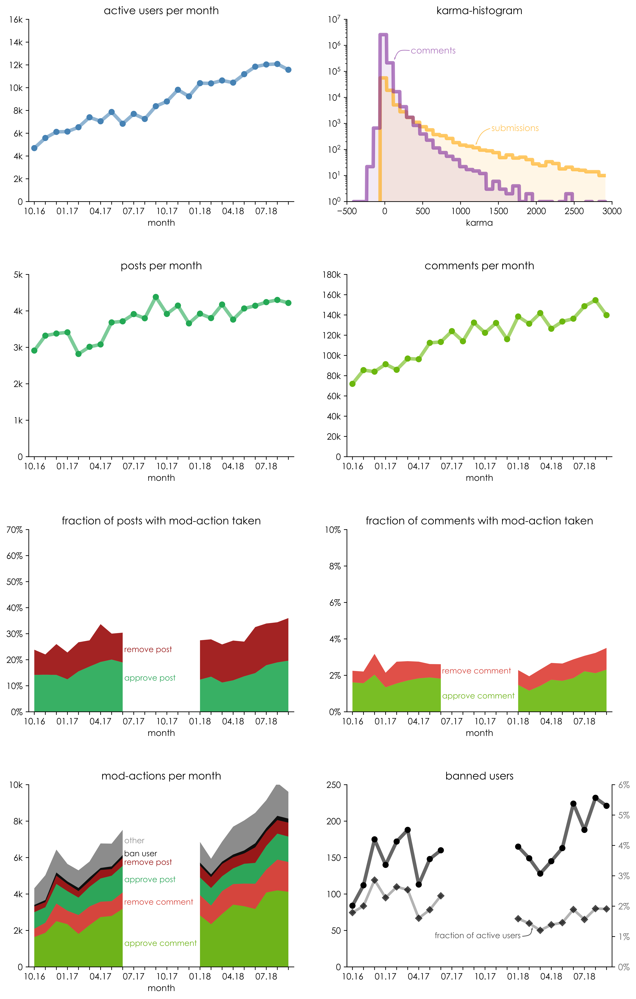

# ModStat

Statistics about the user and moderator activity of [the subreddit /r/de](https://www.reddit.com/r/de/).

### Results

* Each time a post/comment is reported by a user or filtered by a bot, a moderator needs to make an approve/remove devision. 

* The distribution of moderator acions is shown in "mod-actions per month".

* The fraction of all posts/comments on which a mod-action was taken is shown in the "fraction of posts/comments with mod action taken" figures.

* Unfortunately, I did not save the data between 06.17 and 01.18 at the time and reddit does not allow accessing data that is older than 4 months. 

### Prerequisites

* Python 2.7
* Jupyter Notebook
* Packages:
    * matplotlib
    * numpy
    * sys
    * collections
    * datetime
    * scipy

### Raw Data

##### User data

User data was downloaded using collect.py. It makes use of [pushshift.io](https://pushshift.io/reddit/) and reddit's API via [praw](https://praw.readthedocs.io/en/latest/). 

##### Moderation data

The csv-files were downloaded from the moderation log using the moderation log matrix framework, supplied by the [reddit mod toolbox](https://www.reddit.com/r/toolbox/).
Original files are not included for privacy reasons, since they contain the activity profiles of each moderator during each month.

### License

This project is licensed under the MIT License - see the [LICENSE](LICENSE) file for details.